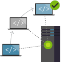
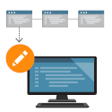

# HACKATHON SEMANAL : Resolución de preguntas RETO 1

## 1. ¿Qué es un control de versiones?
> Es un sistema que apoya al seguimiento de cambios realizados a algún archivo o conjunto de archivos que pueda ser visible al ojo humano a lo largo del tiempo, de modo que se pueda versionar los miles de cambios que puedan realizarse como también recuperar algún cambio anterior. Muy aparte de manipular los cambios, existen herramientas que pueden incluso comparar o visualizar cambios anteriores y si queremos recuperarlos en su totalidad o parcialmente.

## 2. ¿Cuáles son los problemas al no usar un control de versiones?
> Se podría mencionar 3 principales problemas:
>|N°|Problema|Descripción|
>|--|------------------|-----------|
>|1|Proyectos difíciles de gestionar y liderar|Sin un sistema de control de versiones sería complicado liderar un equipo determinado en base al avance colaborativo entre todo el equipo apuntando a un archivo o proyecto.|
>|2|Riesgos a sobrescribir con mi código el avance formal del equipo|Existiría la posibilidad de chancar y/o eliminar el avance del otro compañero, ocasionando algún cambio en el flujo del sistema o nuevo bug.|
>|2|La centralización y poca probabilidad de trabajar individualmente|Centralizar un equipo de trabajo a un solo proyecto y poder evitar que una sola persona trabaje en ese proyecto por el miedo a sobreescribir o malograr un cambio existente.|

## 3. ¿Cuáles son los beneficios?
> Se podría mencionar los siguientes beneficios:
>|N°|Beneficio|Imagen|Descripción|
>|--|------------------|------|-----------|
>|1|Creación de flujos de trabajo||Los flujos de trabajo de control de versiones impiden el caos de todos los usuarios que usan su propio proceso de desarrollo con herramientas diferentes e incompatibles. Los sistemas de control de versiones proporcionan permisos y cumplimiento de procesos para que todos permanezcan en la misma página.|
>|2|Trabajo con versiones||Cada versión tiene una descripción para lo que hacen los cambios en la versión, como corregir un error o agregar una característica. Estas descripciones ayudan al equipo a seguir los cambios en el código por versión en lugar de por cambios de archivo individuales. El código almacenado en versiones se puede ver y restaurar desde el control de versiones en cualquier momento y según sea necesario. Las versiones facilitan la creación de nuevas versiones de cualquier versión del código.|
>|3|Código juntos||El control de versiones sincroniza las versiones y se asegura de que los cambios no entren en conflicto con los cambios de otros usuarios. El equipo se basa en el control de versiones para ayudar a resolver y evitar conflictos, incluso cuando los usuarios realizan cambios al mismo tiempo.|
>|4|Mantener un historial||El control de versiones mantiene un historial de cambios a medida que el equipo guarda nuevas versiones de código. Los miembros del equipo pueden revisar el historial para averiguar quién, por qué y cuándo se realizaron cambios. El historial proporciona a los equipos la confianza de experimentar, ya que es fácil revertir a una versión correcta anterior en cualquier momento. El historial permite a cualquier persona basar el trabajo desde cualquier versión del código, por ejemplo, para corregir un error en una versión anterior.|
>|5|Automatización de tareas||Las características de automatización del control de versiones ahorran tiempo y generan resultados coherentes. Automatizar las pruebas, el análisis de código y la implementación cuando se guardan nuevas versiones en el control de versiones son tres ejemplos.|

## 4. ¿Qué tipos de control de versiones existen?
> Existen 3 tipos de control de versiones:
>|N°|Tipo de control de version|Imagen|Descripción|Ejemplos|
>|--|------------------|------|-----------|--------|
>|1|Locales||El cambio y versiones que se realizan se guardarán en una base de datos de versionamiento local y no será compartido por nadie.|-|
>|2|Centralizados||Existe un repositorio centralizado de todo el código, del cual es responsable un único usuario (o conjunto de ellos). Se facilitan las tareas administrativas a cambio de reducir flexibilidad, pues todas las decisiones fuertes (como crear una nueva rama) necesitan la aprobación del responsable.|CVS, Subversion|
>|3|Distribuidos||Cada usuario tiene su propio repositorio. Los distintos repositorios pueden intercambiar y mezclar revisiones entre ellos. Es frecuente el uso de un repositorio, que está normalmente disponible, que sirve de punto de sincronización de los distintos repositorios locales|Git, Mercurial|

**Alumno: Omar Augusto Collado Vargas**