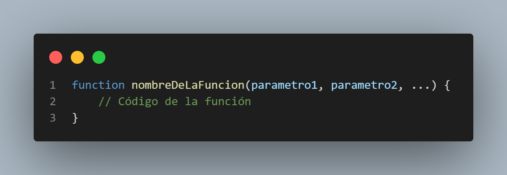
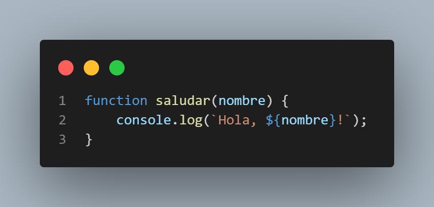
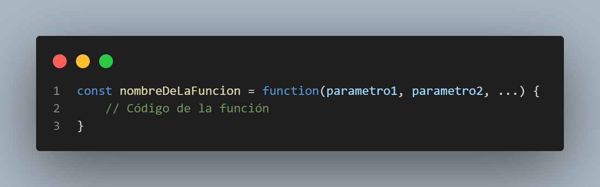
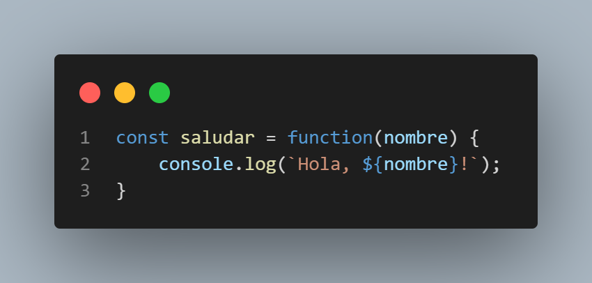
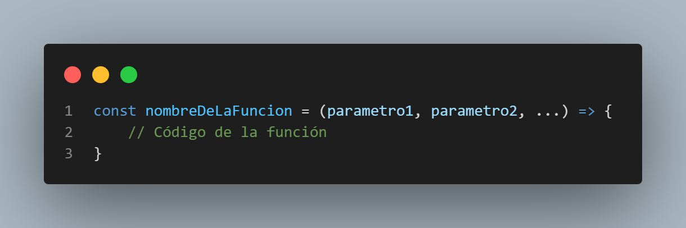
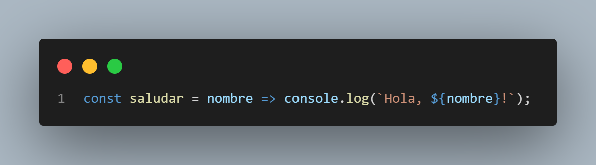
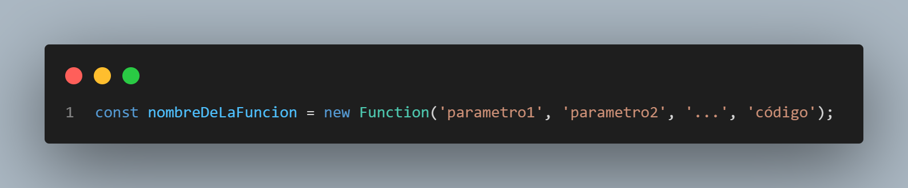
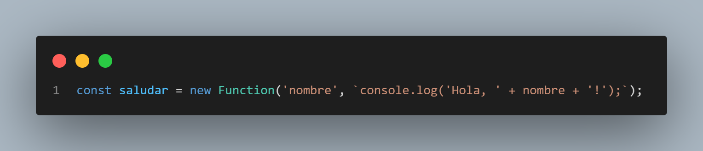

# **Hackaton 10 Reto 01**

## **PREGUNTAS:**

### **1. ¿Cómo defines una función?**

En JavaScript, existen varias formas de definir una función:

**Declaración de función:**

La forma más común de definir una función es mediante una declaración de función, que tiene la siguiente sintaxis:

Por ejemplo:

**Expresión de función:**

Otra forma común de definir una función es mediante una expresión de función, que tiene la siguiente sintaxis:

Por ejemplo:

**Arrow function:**

Una forma más reciente y abreviada de definir una función es mediante una arrow function, que tiene la siguiente sintaxis:

Por ejemplo:

**Constructor de función:**

Es posible definir una función utilizando el constructor de función, aunque esta forma es menos común. Tiene la siguiente sintaxis:

Por ejemplo:

### **2. ¿Hasta cuantos argumentos puedes declarar en una función?**

Una función puede recibir tantos parámetros como se deseen, aunque no sería demasiado razonable que una función reciba más de cuatro o cinco parámetros.

Es cierto que en algunas implementaciones de JavaScript, incluyendo en algunos navegadores web, hay un límite en la cantidad de parámetros que se pueden pasar a una función. En particular, algunas versiones de Internet Explorer limitan el número de parámetros a 255.

Sin embargo, esto no es una limitación del lenguaje JavaScript en sí mismo, sino más bien una limitación de implementación en algunos entornos. En otras palabras, si se usa una implementación de JavaScript que no tiene esta limitación, se pueden pasar más de 255 parámetros a una función.

Además, incluso si se puede pasar una gran cantidad de parámetros a una función, puede ser difícil de manejar y mantener el código si se usa un gran número de argumentos en una función. Por lo tanto, es recomendable mantener el número de parámetros bajo control para facilitar la legibilidad y mantenibilidad del código.
