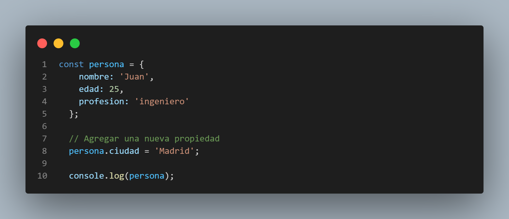
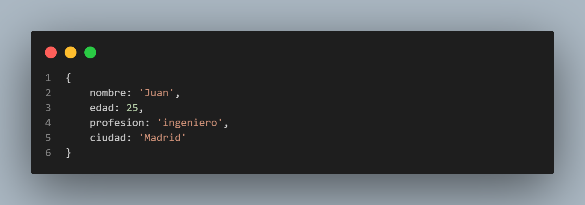
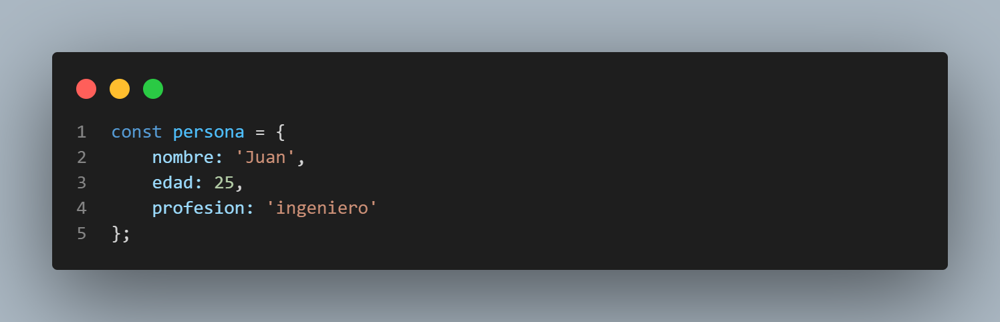
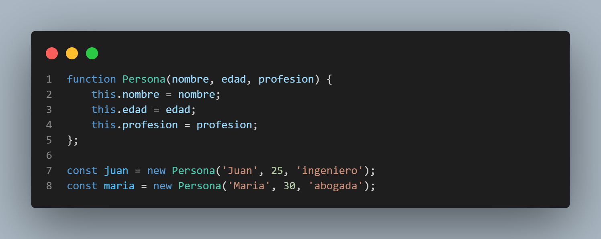
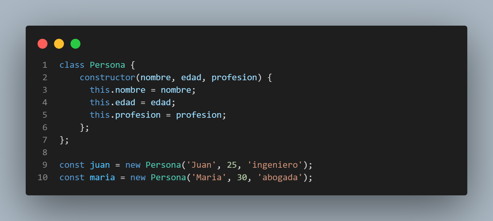

# **Hackaton 11 Reto 01**

## **INSUMOS:**
- Lee el siguinete artículo: [https://developer.mozilla.org/es/docs/Learn/JavaScript/Objects/Object-oriented_JS](https://developer.mozilla.org/es/docs/Learn/JavaScript/Objects/Object-oriented_JS). Uno de los conceptos más usados en Javascript es la Programación Orientada a Objetos. Se debe aprender muy bien todos los conceptos y definiciones que abarcan estos.

## **PREGUNTAS:**

### **1.- ¿Por qué se crean los objetos?**
Los objetos en JavaScript se crean para representar entidades o conceptos del mundo real en forma de estructuras de datos. Un objeto es una colección de propiedades, donde cada propiedad consiste en un par clave-valor. La clave es una cadena que identifica la propiedad, y el valor puede ser cualquier tipo de dato, incluyendo otros objetos.

| Modelado de entidades | Organización de datos | Composición y reutilización de código | Interacción con APIs y servicios externos |
|----------------------------|----------------------------|----------------------------|----------------------------|
| Los objetos permiten representar entidades del mundo real de manera intuitiva. Por ejemplo, si estás construyendo una aplicación de gestión de usuarios, podrías crear un objeto "Usuario" que tenga propiedades como nombre, edad, correo electrónico, etc. Cada instancia de ese objeto representaría a un usuario específico con sus respectivas propiedades. | Los objetos te permiten organizar datos relacionados en una sola estructura. Puedes agrupar propiedades y métodos relacionados dentro de un objeto para facilitar su manipulación y acceso. Esto ayuda a mantener el código más ordenado y modular. | Los objetos pueden ser utilizados como bloques de construcción para crear estructuras más complejas. Puedes crear objetos que contengan otros objetos como propiedades, lo que permite la composición de funcionalidades y la reutilización de código. Esta técnica se conoce como composición de objetos y es fundamental en la programación orientada a objetos. | Muchas APIs y servicios externos utilizan objetos para representar datos y facilitar la comunicación. Al crear objetos en JavaScript, puedes estructurar y formatear los datos de acuerdo con los requisitos de la API o servicio externo con el que estás interactuando. |

### **2.- ¿Qué hubiera pasado si agregaba otra propiedad?**
Si se agrega otra propiedad a un objeto en JavaScript, simplemente se estaría ampliando la estructura del objeto para incluir esa nueva propiedad. Es posible hacerlo de manera directa asignando un valor a una nueva clave en el objeto existente.

En este caso, se ha agregado la propiedad "ciudad" al objeto "persona" con el valor 'Madrid'. Al imprimir el objeto, verás que la propiedad adicional aparece en la salida:

Es posible agregar tantas propiedades como desees al objeto, simplemente repitiendo el proceso de asignación con diferentes claves y valores.

Los objetos en JavaScript son flexibles y dinámicos, lo que significa que puedes agregar o modificar propiedades en cualquier momento, incluso después de haber creado el objeto. Esto te brinda la capacidad de ajustar y adaptar la estructura del objeto según tus necesidades.

### **3.- ¿Se puede generar de otra manera algún objeto?**

- **Objeto literal:** La forma más simple de crear un objeto es utilizando la sintaxis de objeto literal, que consiste en definir las propiedades y sus valores entre llaves ({}):

- **Función constructora:** Puedes utilizar una función constructora para crear múltiples instancias de un objeto con las mismas propiedades y métodos. Dentro de la función, utilizas la palabra clave this para asignar los valores a las propiedades:

- **Clases:** A partir de ECMAScript 2015 (también conocido como ES6), JavaScript introdujo el concepto de clases, que proporciona una sintaxis más sencilla y declarativa para crear objetos. Puedes definir una clase con la palabra clave class y utilizar el método constructor para asignar los valores a las propiedades:

