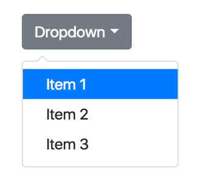

# HACKATHON SEMANAL

## Módulo 5: Javascript y HTTP (Semana 12)
## LOGRO: implementar POO con clases, prototype y uso de patrones y buenas prácticas de desarrollo.
### I.	Es hora de demostrar lo aprendido:
Demostrarás todo lo aprendido en este reto que se basará en las clases dictadas durante la semana.
### II.	Insumos para resolver el Reto:
	Materiales de clase de la semana 1, 2, 3, 11
	https://codeguide.co/

### III.	Descripción del reto
El gran reto está formado por 3 retos. 

   1.	Crear componente dropdown
   2.	Crear componente Accordion
   3.	Crear componente Modal

### IV.	Pasos a seguir para resolver los retos: 

- El docente indicará si este reto se resolverá de manera individual o grupal

# Reto 1

- Crear interfaz en html y css
- Definir función constructora para mostrar y ocultar menú dropdown
- Registrar evento en html para disparar función

# Reto 2

- Crear interfaz en html y css
- Definir función constructora para mostrar elemento actual y ocultar todos los demás
- Registrar evento en html para disparar función

# Reto 3

- Crear interfaz en html y css
- Definir función constructora para definir funcionalidades, de cerrar modal, abrir modal, ejecutar callback cuando se presione botón aceptar, y callback cuando se presione botón cancelar
- Registrar eventos en html para disparar funciones

### V.	Solución del reto
- Para que el reto esté cumplido al 100%, se deben haber respondido las preguntas planteadas y se deben haber resuelto los ejercicios

### VI.	Presentación del Reto
- El documento debe ser presentado de manera individual o grupal (según se coordine con el docente)
- El tiempo de cada presentación lo definirá el docente a cargo

### VII.	Feedback
- El docente dará feedback a los estudiantes sobre los ejercicios realizados